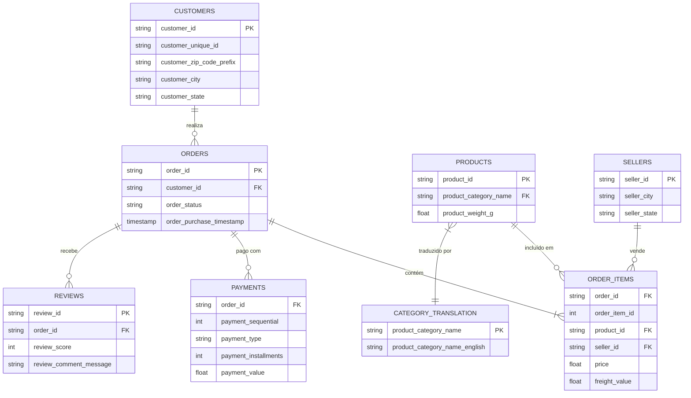
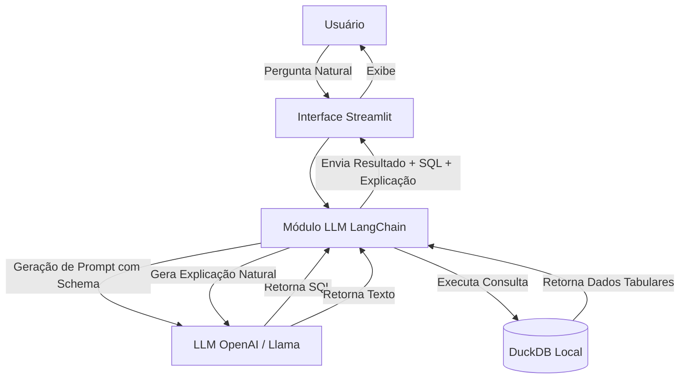

# DataChat SQL 📊

Assistente inteligente capaz de responder perguntas sobre a base de dados **Brazilian E-Commerce Public Dataset (Olist)** utilizando linguagem natural.

> [!IMPORTANT]
> 📚 **DOCUMENTAÇÃO COMPLETA**:  
> Toda a documentação detalhada necessária para este projeto (tais como **Manuais de Instalação, Relatórios Técnicos** e outros materiais complementares) encontra-se na pasta **`artefacts/`**. Por favor, consulte o conteúdo dessa pasta para um entendimento aprofundado do sistema e dos processos de configuração.
>
>🎥 **VÍDEO DEMONSTRATIVO**:
> O vídeo de apresentação e demonstração da aplicação além de estar disponível na pasta **`artefacts/`** e também pode ser acessado pelo link abaixo:
🔗 [Assistir vídeo explicativo do projeto de DataChat SQL] (https://youtu.be/5mfODMxCGTo)

## 1. Estudo da Base Olist

### Visão Geral
A base de dados Olist contém informações reais e anonimizadas de e-commerce brasileiro.
- **Objetivo da Base**: Analisar o comércio eletrônico no Brasil, compreendendo vendas, pagamentos, logística, produtos e avaliações de clientes.
- **Período dos Dados**: Pedidos realizados entre **2016 e 2018**.
- **Volume**: Aproximadamente **100 mil pedidos**.
- **Tabelas**: 8 tabelas relacionais utilizadas no projeto.

### Diagrama Entidade-Relacionamento (ER)



## 2. Importação dos Arquivos CSV

Os arquivos foram importados com sucesso para um banco de dados **DuckDB**. Abaixo o papel de cada arquivo:

| Arquivo | Tabela | Chave Primária | Principais Chaves Estrangeiras | Descrição do Conteúdo |
|---------|--------|----------------|--------------------------------|-----------------------|
| `olist_orders_dataset.csv` | `orders` | `order_id` | `customer_id` | Detalhes do pedido (status, datas de compra e entrega). |
| `olist_order_items_dataset.csv` | `order_items` | N/A (Composta) | `order_id`, `product_id`, `seller_id` | Itens comprados dentro de cada pedido, preços e fretes. |
| `olist_products_dataset.csv` | `products` | `product_id` | N/A | Dados físicos e de categoria dos produtos. |
| `olist_customers_dataset.csv` | `customers` | `customer_id` | N/A | Identificação e localização dos clientes. |
| `olist_sellers_dataset.csv` | `sellers` | `seller_id` | N/A | Identificação e localização dos vendedores. |
| `olist_order_payments_dataset.csv` | `payments` | N/A (Composta) | `order_id` | Formas, parcelas e valores de pagamento. |
| `olist_order_reviews_dataset.csv` | `reviews` | `review_id` | `order_id` | Avaliações, notas e comentários deixados pelos clientes. |
| `product_category_name_translation.csv` | `category_translation` | `product_category_name` | N/A | Tradução das categorias de português para inglês. |

## 3. Criação do Banco de Dados e Testes

O script `src/setup_database.py` é responsável por criar o arquivo `data/datachat.duckdb` e carregar os 8 arquivos CSV de forma otimizada.
No script `src/test_queries.py`, existem 5 consultas de exemplo (contagem de pedidos, faturamento por categoria, etc.) comprovando a integridade relacional da base.

## 4. Definição da Arquitetura da Solução

O sistema adotará uma arquitetura modular focada na integração eficiente do Large Language Model (LLM) com o banco de dados.



**Componentes:**
1. **Frontend**: Interface construída em Streamlit para fácil interação, com histórico de consultas e placeholders.
2. **Orquestrador LLM**: Utilização de LangChain ou LlamaIndex para injetar o schema do banco (DDL) no prompt e evitar alucinações.
3. **Database Engine**: DuckDB rodando localmente (in-memory/file-based) executando as queries SQL diretamente.
4. **LLM Engine**: API do modelo de linguagem, encarregada da tradução `Text-to-SQL` e `Data-to-Text`.

## 5. Análise das Tecnologias

Foi realizada uma análise crítica das tecnologias sugeridas no projeto, as quais foram validadas e aprovadas:

- **DuckDB**: Excelente escolha no lugar de SQLite/PostgreSQL. É focado em OLAP (consultas analíticas), não requer servidor externo, e lê arquivos CSV de forma nativa e extremamente rápida.
- **Streamlit**: Aprovado. Permite criar rapidamente protótipos de dados com suporte a gráficos e DataFrames, abstraindo a complexidade de HTML/JS/CSS.
- **LangChain**: Muito útil. Simplifica a construção de "Chains" que pegam o schema do banco, enviam pro LLM, rodam a query gerada e retornam. Fornece o módulo `SQLDatabaseChain`.
- **Python**: Linguagem padrão ouro para dados e IA, altamente recomendada.
- **LLM**: Como a aplicação precisa entender esquemas SQL complexos (com JOINs), é altamente recomendável utilizar modelos fortes no raciocínio, como o **GPT-4o-mini**, em vez de modelos menores ou open-source locais mais fracos, a fim de garantir SQLs precisos.

## 6. Como Executar o Protótipo e Scripts (Padrão UV)

Para garantir padronização absoluta das dependências em todas as máquinas da equipe e altíssima velocidade de instalação, este projeto utiliza o **[uv](https://github.com/astral-sh/uv)** da Astral como gerenciador de pacotes e ambientes virtuais, substituindo o antigo `pip` e `requirements.txt`.

1. **Sincronize as dependências** (isso criará o ambiente virtual `.venv` automaticamente e instalará o exato conteúdo do `uv.lock`):
```bash
uv sync
```

2. **Crie o Banco de Dados DuckDB** importando os CSVs:
```bash
uv run python src/setup_database.py
```

3. **Teste as consultas**:
```bash
uv run python tests/test_queries.py
```

4. **Suba a aplicação Streamlit**:
```bash
uv run streamlit run app/app.py
```

## 7. Funcionalidades e Estrutura do Projeto

O projeto atingiu sua completude estrutural integrando as seguintes funcionalidades e componentes principais:

- **Integração Plena LLM ↔ DB**: A aplicação recebe perguntas na interface (Streamlit), processa no backend junto ao Groq (`llama-3.3-70b-versatile`), roda no DuckDB e exibe visualmente os dados formatados.
- **Tratamento de Erros e Estabilidade**: Foram adicionados tratamentos (`try/except`) para proteger a aplicação contra interrupções abruptas causadas por indisponibilidade de API ou alucinações (SQLs inválidos). Os erros são convertidos em alertas amigáveis no frontend.
- **Histórico de Consultas (State)**: A aplicação mantém um histórico em sessão (`st.session_state`), listando perguntas anteriores, scripts SQL gerados e respostas diretamente em uma aba da UI para acesso rápido.
- **Consultas Multi-tabelas (Alta Complexidade)**: A precisão relacional foi comprovada integrando até 5 tabelas simultâneas (ex: `reviews`, `orders`, `order_items`, `products` e `category_translation`).

### Principais Módulos do Sistema:
- **`src/db.py`**: Camada de banco de dados para a conexão com DuckDB e extração do esquema DDL dinâmico.
- **`src/text_to_sql.py`**: Módulo que interage com o LLM (LangChain + Groq) configurado por meio de Prompt Engineering restrito e seguro.
- **`src/backend.py`**: Orquestrador que interliga a requisição, geração do SQL e execução no banco.

### Testes Adicionais

Para testar isoladamente o núcleo de Text-to-SQL, execute:
```bash
uv run python tests/test_text_to_sql.py
```

Para testar o estresse das consultas multi-tabelas, execute:
```bash
uv run python tests/test_multi_table_queries.py
```
