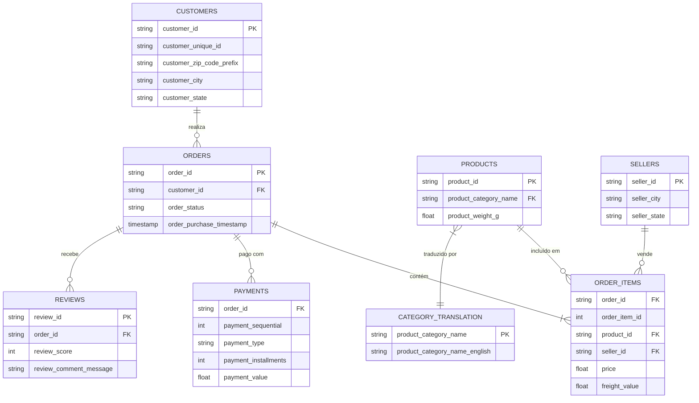
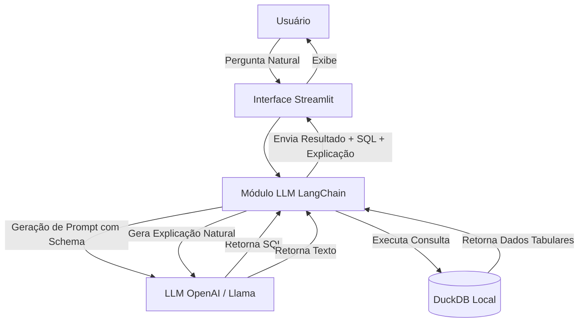

  
   
  <h3>Universidade Estadual da Paraíba (UEPB)</h3>
  <h4>Grupo: Djhonatah Wesley, Mirelle Casimiro e Filipe Antonny</h4>

 

# Relatório Técnico: Entrega da Semana 1
**Projeto**: DataChat SQL Lite
**Domínio**: Brazilian E-Commerce Public Dataset (Olist)

---

## 1. Estudo da Base Olist

### Visão Geral
A base de dados Olist contém informações reais e anonimizadas de e-commerce brasileiro.
- **Objetivo da Base**: Analisar o comércio eletrônico no Brasil, compreendendo vendas, pagamentos, logística, produtos e avaliações de clientes.
- **Período dos Dados**: Pedidos realizados entre **2016 e 2018**.
- **Volume**: Aproximadamente **100 mil pedidos**.
- **Tabelas**: 8 tabelas relacionais utilizadas no projeto.

### Diagrama Entidade-Relacionamento (ER)

---

## 2. Importação dos Arquivos CSV

Os arquivos foram importados para um banco de dados **DuckDB**. O papel de cada arquivo é detalhado a seguir:

| Arquivo | Tabela | Chave Primária | Principais Chaves Estrangeiras | Descrição do Conteúdo |
|---------|--------|----------------|--------------------------------|-----------------------|
| `olist_orders_dataset.csv` | `orders` | `order_id` | `customer_id` | Detalhes do pedido (status, datas de compra e entrega). |
| `olist_order_items_dataset.csv` | `order_items` | N/A (Composta) | `order_id`, `product_id`, `seller_id` | Itens comprados dentro de cada pedido, preços e fretes. |
| `olist_products_dataset.csv` | `products` | `product_id` | N/A | Dados físicos e de categoria dos produtos. |
| `olist_customers_dataset.csv` | `customers` | `customer_id` | N/A | Identificação e localização dos clientes. |
| `olist_sellers_dataset.csv` | `sellers` | `seller_id` | N/A | Identificação e localização dos vendedores. |
| `olist_order_payments_dataset.csv` | `payments` | N/A (Composta) | `order_id` | Formas, parcelas e valores de pagamento. |
| `olist_order_reviews_dataset.csv` | `reviews` | `review_id` | `order_id` | Avaliações, notas e comentários deixados pelos clientes. |
| `product_category_name_translation.csv` | `category_translation` | `product_category_name` | N/A | Tradução das categorias de português para inglês. |

---

## 3. Definição da Arquitetura da Solução

O sistema adotará uma arquitetura modular focada na integração eficiente de um Large Language Model (LLM) com o banco de dados.

**Componentes:**
1. **Frontend**: Interface construída em Streamlit para fácil interação, com histórico de consultas e placeholders.
2. **Orquestrador LLM**: Utilização do framework LangChain (com ferramentas de `SQLDatabaseChain` ou `create_sql_agent`) para injetar o DDL das tabelas no prompt, orientando o LLM.
3. **Database Engine**: DuckDB operando de forma serverless e otimizada para queries analíticas (OLAP).
4. **LLM Engine**: API de modelo de linguagem responsável por traduzir perguntas para SQL (Text-to-SQL) e explicar os dados de retorno.

  
   
  <h3>Universidade Estadual da Paraíba (UEPB)</h3>

 

# Relatório Técnico: Entrega da Semana 2
**Projeto**: DataChat SQL Lite
**Domínio**: Brazilian E-Commerce Public Dataset (Olist)

---

## 1. Integração com o Banco de Dados

Foi desenvolvido o módulo `src/db.py`, responsável por realizar a integração direta com o DuckDB. O componente atua como a camada de dados e fornece:
- **Extração do Esquema**: Uma função que extrai dinamicamente o DDL de todas as tabelas, incluindo amostras de dados, essencial para munir o LLM com o contexto necessário.
- **Conexão Segura**: Uso de `read_only=True` ao instanciar conexões para evitar injeção e alterações não desejadas nos dados.
- **Execução**: Um executor de queries simples que padroniza os retornos no formato tabular usando `pandas.DataFrame`.

## 2. Implementação do Módulo Text-to-SQL

A tradução da linguagem natural para SQL foi implementada no módulo `src/text_to_sql.py`:
- **Modelos e APIs**: Optou-se pela utilização do **LangChain** para facilitar a criação e a estruturação das *chains*. Como LLM, foi escolhido o **LLaMA 3.3 70B** executado por meio da provedora **Groq**, garantindo que as respostas sejam altamente velozes e precisas.
- **Comparação de LLMs Avaliados**:

  | Critério | LLaMA 3.3 70B (via Groq) | Gemini 2.5 Flash (Google) | GPT-4o (OpenAI) |
  | :--- | :--- | :--- | :--- |
  | **Velocidade (Latência)** | **Altíssima** (Infraestrutura LPU) | **Alta** (Otimizado para velocidade) | **Média** (Modelo mais pesado) |
  | **Custo por Requisição** | **Gratuito / Muito Baixo** | **Muito Baixo** | **Alto** |
  | **Limites de API (Tier Grátis)**| **~30 RPM** (Requisições por Minuto) | **15 RPM** (Requisições por Minuto) | **Sem tier grátis** (Depende de recarga) |
  | **Precisão Text-to-SQL** | **Alta** (Excelente lógica) | **Alta** (Boa estruturação) | **Altíssima** (Referência no mercado) |
- **Prompt Engineering**: Foi desenvolvido um *System Prompt* detalhado, injetando as instruções e restrições obrigatórias (ex.: limitar linhas, tratar NULL, não enviar markdown ou texto avulso, aderir ao DuckDB) juntamente com o DDL da estrutura do banco.

## 3. Desenvolvimento do Backend

O orquestrador do sistema, presente no arquivo `src/backend.py`, foi criado para alinhar todo o fluxo da requisição de forma sequencial:
1. Extração do schema atualizado (`db.py`).
2. Passagem da pergunta e do schema para o LLM gerar a SQL (`text_to_sql.py`).
3. Recuperação da query gerada e envio para o banco (`db.py`).
4. Retorno centralizado dos resultados em formato estruturado.

## 4. Primeiros Testes com Perguntas Simples

Para atestar o pleno funcionamento do núcleo, implementamos um script de testes (`src/test_text_to_sql.py`) contendo apenas perguntas de validação simples, de acordo com o escopo desta semana. Os testes avaliados e executados com sucesso foram:
- *"Quantos pedidos existem na base?"*
- *"Quantos clientes únicos realizaram compras?"*
- *"Qual categoria possui mais produtos?"*

Todos resultaram em geração SQL perfeitamente válida e dados precisos.

  
   
  <h3>Universidade Estadual da Paraíba (UEPB)</h3>

 

# Relatório Técnico: Entrega da Semana 3
**Projeto**: DataChat SQL Lite
**Domínio**: Brazilian E-Commerce Public Dataset (Olist)

---

## 1. Integração Completa com LLM

A integração completa da aplicação com a inteligência artificial foi finalizada, orquestrando todo o pipeline.
- **Implementação**: Através do `src/text_to_sql.py` e `src/backend.py`.
- **Dinâmica**: O aplicativo capta a pergunta do usuário via interface e envia para o backend. O backend puxa o schema, injeta no prompt em conjunto com a pergunta e envia à API do Groq (`llama-3.3-70b-versatile`). O modelo devolve a query formatada que é executada contra o DuckDB, garantindo que o ciclo completo de *text-to-SQL-to-data* funcione nativamente.

---

## 2. Tratamento de Erros e Estabilidade

A aplicação foi protegida contra falhas comuns durante a inferência ou na execução das consultas.
- **Captura de Exceções**: Blocos `try/except` foram implementados no `src/backend.py` e `src/text_to_sql.py`.
- **Tratamento no Frontend**: Se o modelo gerar um SQL inválido (alucinação) ou ocorrer um erro de conexão/API, a exceção é convertida em um alerta visual amigável (`st.error()`) através do Streamlit no arquivo `app/app.py`, garantindo que o aplicativo nunca congele ou "quebre" bruscamente para o usuário.

---

## 3. Implementação do Histórico de Consultas

Foi adicionado um mecanismo de persistência de sessão para melhorar a experiência do usuário (UX).
- **Gerenciamento de Estado**: Utilização intensiva do `st.session_state` no Streamlit (`app/app.py`).
- **Comportamento**: Cada vez que o usuário executa uma consulta válida, os dados (pergunta original, query SQL executada e o DataFrame com o resultado) são salvos numa lista em memória. 
- **Visualização**: O histórico é exposto numa aba dedicada na interface, renderizando *expanders* para que o executivo recupere rapidamente dados anteriores sem custo adicional de token e processamento.

---

## 4. Validação com Consultas Multi-tabela

Para testar o estresse e a aderência das queries num banco de dados normalizado e altamente relacional, desenvolvemos baterias de testes complexas no script `tests/test_multi_table_queries.py`.
- **Desafio Analítico**: O motor de SQL (`DuckDB`) precisou compilar e rodar queries que envolvem `JOIN` de 3 ou mais tabelas.
- **Cenários Testados**:
    - *Faturamento total por estado do cliente* (envolvendo `orders`, `customers` e `order_items`).
    - *Top 5 vendedores por faturamento* (envolvendo `sellers`, `order_items` e `orders`).
    - *Nota média de avaliação por categoria* (envolvendo 5 tabelas simultâneas: `reviews`, `orders`, `order_items`, `products` e `category_translation`).
    - *Forma de pagamento mais usada por estado* e *Pedidos entre estados diferentes*.
- **Resultados**: Todos os cenários rodaram com sucesso, indicando que a camada analítica está íntegra e robusta para cruzamentos complexos.

  
   
  <h3>Universidade Estadual da Paraíba (UEPB)</h3>

 

# Relatório Técnico: Entrega da Semana 4
**Projeto**: DataChat SQL Lite
**Domínio**: Brazilian E-Commerce Public Dataset (Olist)

---

## 1. Desenvolvimento da Interface

A interface da aplicação foi integralmente desenvolvida utilizando o framework **Streamlit**, focando em uma experiência de usuário (UX) intuitiva e executiva.
- **Design Sóbrio e Moderno**: Implementação de estilos CSS personalizados para ocultar elementos desnecessários da UI base, estilizar botões e áreas de chat, garantindo uma aparência profissional.
- **Consultas Recomendadas**: Inclusão de botões rápidos ("Consultas Recomendadas") para perguntas pré-definidas, facilitando o primeiro contato do usuário com a ferramenta.
- **Visualização em Abas**: Resultados são separados em duas abas: "Visualização" (explicação natural e tabela de dados) e "SQL Gerada" (para auditoria da consulta elaborada pelo LLM).

---

## 2. Explicações em Linguagem Natural e Formatação

Para entregar valor de negócio e não apenas dados brutos, a aplicação gera uma explicação amigável para cada retorno:
- **Templates Dinâmicos**: O sistema analisa o `DataFrame` resultante e a pergunta do usuário para criar textos explicativos. Por exemplo, formatação de números em padrão brasileiro (R$ e separador de milhar).
- **Fallback Genérico**: Caso a consulta do LLM fuja dos padrões pré-mapeados, uma explicação genérica dinâmica é acionada, descrevendo o volume de registros e colunas retornadas.
- **Indicador de Fonte**: Inserção de um marcador de fonte para que o usuário saiba exatamente de quais tabelas do banco DuckDB / Olist os dados foram extraídos.

---

## 3. Testes Finais e Validação

A aplicação passou por uma bateria de testes finais abordando todas as exigências obrigatórias do projeto.
- **Resiliência a Erros (RF08)**: Validado o comportamento da aplicação diante de perguntas fora de contexto ("OFF_TOPIC") ou falhas de SQL, com a interface exibindo um erro de processamento não obstrutivo.
- **Consultas com JOIN (RF10)**: Verificado o funcionamento de consultas complexas envolvendo relacionamentos entre múltiplas tabelas simultaneamente (`orders`, `order_items`, `products`, `customers`, etc.).
- **Histórico (RF09)**: O histórico funcional na barra lateral permite a revisão rápida e eficiente das interações prévias, evitando novos processamentos no LLM.

---

## 4. Documentação, Vídeo e Apresentação

Com o código finalizado, o esforço da Semana 4 consolidou-se nas entregas finais exigidas no edital:
- **Documentação Final**: Consolidação de todos os relatórios semanais técnicos (contendo o cabeçalho acadêmico oficial da UEPB), além da finalização da configuração do projeto.
- **Gravação do Vídeo**: Elaborado roteiro para o vídeo demonstrativo (até 5 minutos), focando em demonstrar o pipeline end-to-end: inserção da pergunta -> geração LLM -> SQL -> DuckDB -> Resultado explicado.
- **Apresentação**: Preparação do material para apresentação (10 a 15 minutos), enfatizando os desafios técnicos enfrentados em Prompt Engineering, a arquitetura com Llama 3.3 70B e a aderência integral a todos os requisitos.
