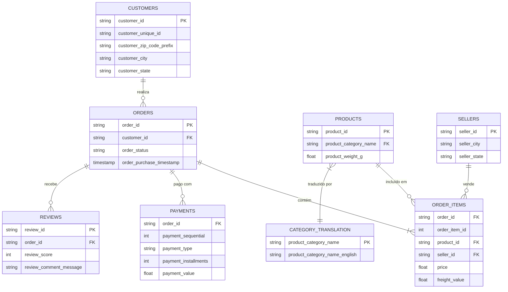
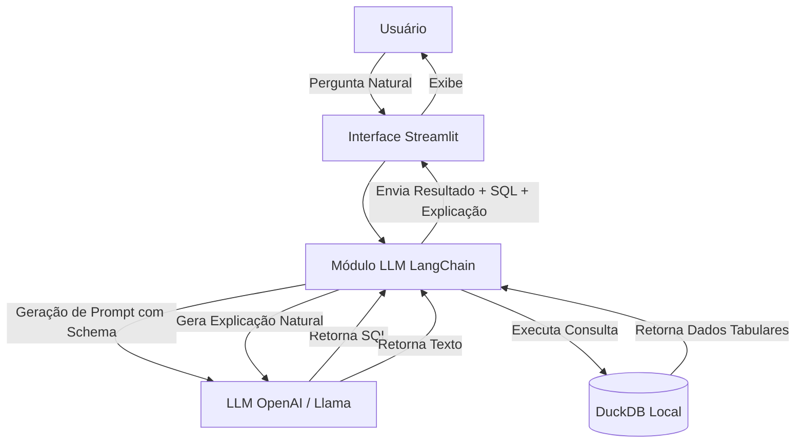

# Relatório Técnico: Entrega da Semana 1
**Projeto**: DataChat SQL Lite
**Domínio**: Brazilian E-Commerce Public Dataset (Olist)

---

## 1. Estudo da Base Olist

### Visão Geral
A base de dados Olist contém informações reais e anonimizadas de e-commerce brasileiro.
- **Objetivo da Base**: Analisar o comércio eletrônico no Brasil, compreendendo vendas, pagamentos, logística, produtos e avaliações de clientes.
- **Período dos Dados**: Pedidos realizados entre **2016 e 2018**.
- **Volume**: Aproximadamente **100 mil pedidos**.
- **Tabelas**: 8 tabelas relacionais utilizadas no projeto.

### Diagrama Entidade-Relacionamento (ER)

---

## 2. Importação dos Arquivos CSV

Os arquivos foram importados para um banco de dados **DuckDB**. O papel de cada arquivo é detalhado a seguir:

| Arquivo | Tabela | Chave Primária | Principais Chaves Estrangeiras | Descrição do Conteúdo |
|---------|--------|----------------|--------------------------------|-----------------------|
| `olist_orders_dataset.csv` | `orders` | `order_id` | `customer_id` | Detalhes do pedido (status, datas de compra e entrega). |
| `olist_order_items_dataset.csv` | `order_items` | N/A (Composta) | `order_id`, `product_id`, `seller_id` | Itens comprados dentro de cada pedido, preços e fretes. |
| `olist_products_dataset.csv` | `products` | `product_id` | N/A | Dados físicos e de categoria dos produtos. |
| `olist_customers_dataset.csv` | `customers` | `customer_id` | N/A | Identificação e localização dos clientes. |
| `olist_sellers_dataset.csv` | `sellers` | `seller_id` | N/A | Identificação e localização dos vendedores. |
| `olist_order_payments_dataset.csv` | `payments` | N/A (Composta) | `order_id` | Formas, parcelas e valores de pagamento. |
| `olist_order_reviews_dataset.csv` | `reviews` | `review_id` | `order_id` | Avaliações, notas e comentários deixados pelos clientes. |
| `product_category_name_translation.csv` | `category_translation` | `product_category_name` | N/A | Tradução das categorias de português para inglês. |

---

## 3. Definição da Arquitetura da Solução

O sistema adotará uma arquitetura modular focada na integração eficiente de um Large Language Model (LLM) com o banco de dados.

**Componentes:**
1. **Frontend**: Interface construída em Streamlit para fácil interação, com histórico de consultas e placeholders.
2. **Orquestrador LLM**: Utilização do framework LangChain (com ferramentas de `SQLDatabaseChain` ou `create_sql_agent`) para injetar o DDL das tabelas no prompt, orientando o LLM.
3. **Database Engine**: DuckDB operando de forma serverless e otimizada para queries analíticas (OLAP).
4. **LLM Engine**: API de modelo de linguagem responsável por traduzir perguntas para SQL (Text-to-SQL) e explicar os dados de retorno.

---

## 4. Análise Crítica das Tecnologias

As tecnologias sugeridas para o projeto foram avaliadas pela equipe e validadas com sucesso:

1. **DuckDB em vez de SQLite/PostgreSQL**: É a escolha ideal. Por se tratar de um projeto que faz consultas agregadoras e analíticas sobre dados parados (OLAP), o DuckDB entrega uma performance infinitamente superior ao SQLite, sem a complexidade de gerir um servidor PostgreSQL, além de ter integração perfeita em Python.
2. **Gestão de Dependências (uv)**: Para evitar instabilidades no grupo, substituímos o `pip` pelo `uv`. Isso centraliza a configuração em um `pyproject.toml` e usa o arquivo de bloqueio `uv.lock`, garantindo as exatas mesmas versões para toda a equipe em velocidades extremas.
3. **Streamlit**: Permite construir uma interface completa de dados, com suporte a visualização de DataFrames e gráficos plotados no Python, dispensando codificação em JavaScript/HTML. Excelente aderência ao projeto.
4. **LangChain / LlamaIndex**: Ferramentas perfeitas para a construção da pipeline de recuperação de SQL e injeção do dicionário de dados (Schema). O LangChain será empregado como orquestrador.
5. **Modelos (GPT-4o-mini / Llama 3)**: Devido à complexidade de 8 tabelas e múltiplos JOINs, Modelos LLM básicos podem alucinar. Por isso, utilizaremos preferencialmente GPT-4o-mini via API, sendo capaz de absorver bem as instruções e criar queries exatas, ou opções equivalentes com bom raciocínio SQL.
